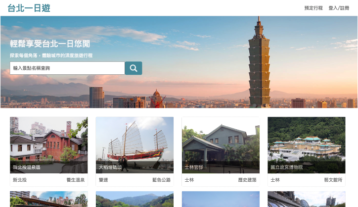
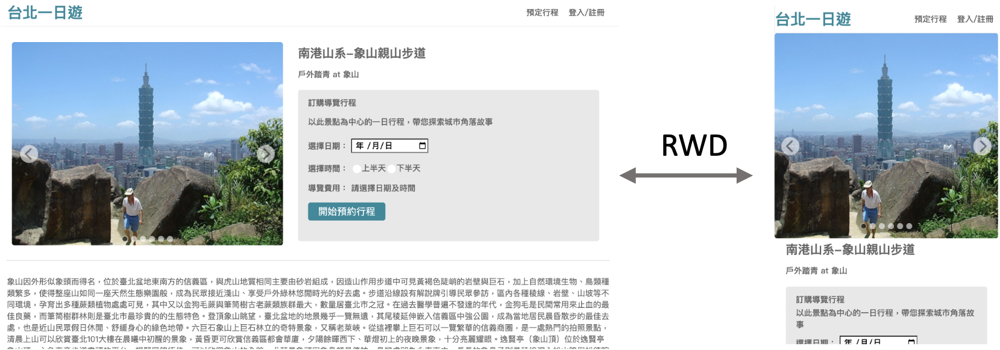
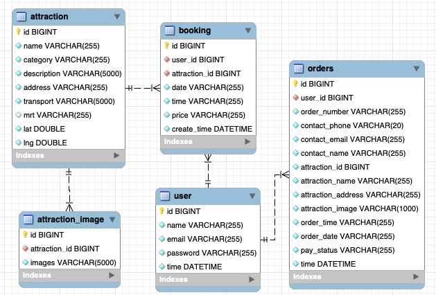

# Taipei Day Trip
## Project Introduction

This is a travel companion reservation website designed around a one-day tour of Taipei. Users can select the desired tourist spots and time, make reservations online, pay online, and a guide will be assigned to accompany and guide them, leaving you with wonderful memories.

### Feel free to use the following account for testing:

- Email: test@test.com
- Password: test123

Use this account information to make a reservation and payment.

### Test Credit Card Information

- Card Number: 4242 4242 4242 4242
- Expiration Date: 01/23
- CVV: 123

## How to Use
After entering the homepage, select the desired tourist spots, enter the reservation page, login with your account information, select the date and time, and then proceed to the payment page. After entering the credit card information and submitting, the subscription will be completed.

In addition, you can click on the "Member Center" in the upper right corner to adjust your name and email, browse past orders, and log out of the member account by clicking on "Logout" in the upper right corner.

## Technologies Used
### Front-end
This project uses HTML, CSS, and JavaScript for front-end design.
To achieve front-end and back-end separation, it follows the project-defined RESTful API for operation.
And it is designed with responsive web design (RWD) to adapt to different screen sizes of devices and display the content accordingly.

### Back-end
The back-end of this project is developed using Python and the Flask framework as the web application framework. To connect to the MySQL database, we use the mysql.connector and mysql.connector.pooling packages to facilitate database management and access. In addition, to improve the security of the database, we use the JWT framework to establish a token mechanism and use the dotenv package to create a .env file to ensure that account information is not leaked.

In terms of architecture, we adopt the MVC architecture and front-end and back-end separation. This can make the code more readable, maintainable, and scalable.
### SQL
